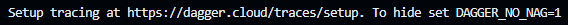

# Getting started with Dagger

L'objectif est de construire les composants d'un pipeline de CI pour une application web - ***hello*** - (permettant de faire un `hello <ce que l'on veut>`) sous la forme d'un module Dagger.

## Initialisation du module Dagger

> [!NOTE]
> Si pas d'utilisation du codespace mis à disposition, faire un clone du repository du codelab sur votre machine:
> ```bash
> git clone https://github.com/jhaumont/Enter-the-Daggerverse.git
> ```

Ouvrir le répertoire de l'application hello:
```bash
cd hello
```

> [!IMPORTANT]
> Toutes les commandes suivantes seront jouées dans le répertoire `hello` depuis votre terminal.

Initialiser votre module de Dagger:
```bash
dagger init --sdk=go --source=./dagger
```

Cette commande va télécharger l'image docker du Dagger engine, le démarrer et générer votre structre de module Dagger:
- Un fichier `dagger.json` de metadata
- Un répertoire `dagger`: 
  - Un fichier `main.go` qui va contenir le code de votre module.
  - Un ficher `dagger.gen.go` contenant du code utilitaire généré par Dagger
  - Une repertoire `internal` contenant du code utilitaire généré par Dagger

Remplacer, dans le fichier `dagger/main.go`, le code existant par celui-ci :

```go
package main

import (
	"context"
	"dagger/hello/internal/dagger"
	"fmt"
	"math"
	"math/rand/v2"
)

type Hello struct {
}

// Publish the application container after building and testing it on-the-fly
func (m *Hello) Publish(ctx context.Context, source *dagger.Directory) (string, error) {
	return m.Build(source).
		Publish(ctx, fmt.Sprintf("ttl.sh/hello-%.0f", math.Floor(rand.Float64()*10000000))) //#nosec
}

// Build the application container
func (m *Hello) Build(source *dagger.Directory) *dagger.Container {
	build := m.BuildEnv(source).
		WithExec([]string{"go", "build", "-o", "bin/"}).
		Directory("./bin")
	return dag.Container().From("debian:bookworm-slim").
		WithDirectory("/usr/bin/", build).
		WithExposedPort(666).
		WithEntrypoint([]string{"/usr/bin/hello"})
}

// Build a ready-to-use development environment
func (m *Hello) BuildEnv(source *dagger.Directory) *dagger.Container {
return dag.Container().
	From("golang:1.23-alpine").
	WithDirectory("/src", source).
	WithWorkdir("/src").
	WithEnvVariable("CGO_ENABLED", "0")
}
```

> [!NOTE]
> Votre module se compose dorénavant de 3 fonctions :
> - `BuildEnv` pour construire un environnement (une image docker) pour être utilisée par les autres fonctions
> - `Build` pour builder votre application web
> - `Publish` pour publier sur la registry `ttl.sh` votre application


> [!WARNING]
> Le fichier `dagger.gen.go` a un problème de compilation.
> 
> En changeant le contenu du fichier, l'interface a évolué.
> 
> Regénérer le code Dagger du module:
>
> ```bash
> dagger develop
> ```

## Construire l'environnement pour le pipeline de CI de l'application

Maintenant que nous avons un module, nous allons lancer une de ces fonctions:
```bash
dagger call build-env --source=.
```

> [!NOTE]
> La fonction GO BuildEnv est devenu `build-env` en argument de la commande `dagger`. Dagger utilise le style `kebab-case` pour convertir les fonctions (et arguments, champs, etc) créés afin d'avoir une interface standardisée, peut importe le langage utilisé.

Vous allez avoir des traces ***interactives*** dans votre shell.
Essayer de les manipuler. Par exemple, augmenter la verbosité, cela peut aider dans l'analyse et la conpréhension.

> [!NOTE]
> Toutes les traces & spans que vous voyez, c'est de l'OpenTelemetry, comme pour une requête HTTP.
> C'est verbeux et perturbant au debut, et très lié à Docker. 
> Mais petit à petit, on s'y fait bien.

A la fin de l'exécution de la commande, vous allez voir ce message:


Par défaut, Dagger va essayer d'envoyer les traces dans le Dagger cloud. C'est un peu génant si on ne le souhaite pas. 

Déésactiver les comme conseillé et relancer la commande:
```bash
export STOPIT=1
dagger call build-env --source=.
```
Le message a disparu.

> [!WARNING]
Attention, il y a plusieurs possibilités de variables pour désactiver les traces: `GOAWAY, SHUTUP, STOPIT, NOTHANKS, etc`

Vous avez maintenant un environnement d'exécution GO contenant les sources de votre projet à votre disposition.

## Dagger cloud

Afin d'exploiter plus facilement les traces, nous allons utiliser le dagger cloud.

Réactiver l'envoi de traces:

```bash
unset STOPIT=1
```

Créer un compte cloud:
https://docs.dagger.io/manuals/user/cloud-get-started

> [!TIP]
> Utiliser votre compte GitHub

Créer l'organisation `devfest`.

Un token vous est proposé. Exporter le:

```bash
export DAGGER_CLOUD_TOKEN=<token>
```

Pour ne plus avoir à le faire à chaque ouverture de session/terminal, il faut ajouter ce token à votre contexte (`.profile` ou autre)

## Intéragir avec le résultat de votre fonction

Lorsque votre fonction retourne une image docker, vous avez la possibilité d'interagir avec cette dernière pour inspecter son contenu.

Lancer à nouveau la commande de `build-env` avec la commande `terminal`:

```bash
dagger call build-env --source=. terminal --cmd=sh
```

> [!WARNING]
> Bien choisir une image qui possède un shell (sh, bash, etc))

Vérifier que le répertoire du projet a bien été monté dans l'image:
```bash
ls -al
```

Taper `exit` pour quitter.

A la fin de l'exécution, un lien vers le Dagger cloud vous est proposé. Cliquer dessus pour explorer les traces de votre commande.

## Builder l'application

Maintenant que nous avons un environnement GO, nous allons pouvoir builder notre application.

Lancer la commande:
```bash
dagger call build --source=.
```

Votre application a été buildée ! L'output de la fonction est une image docker prête à l'emploi !

Relancer le build pour intéragir avec l'image
```bash
dagger call build --source=. terminal --cmd=sh
```

Vérifier que le binaire de notre application est bien présent:
```bash
ls -al /bin/hello
```

Taper `exit` pour quitter.

## Tester l'application

Maintenant que nous avons builder notre application, si nous la testions sur notre poste ?

Démarrer l'application avec la command `as-service` de Dagger :
```bash
dagger call build --source=. as-service up --ports=8080:666
```

Cliquer sur le bouton proposé par VSCode et ajouter `/devfest` à la fin de l'url de la page.

> [!NOTE]
> Si pas d'utilisation du codespace, ouvrir votre navigateur et entrez l'URL suivante `localhost:8080/devfest`.

## Publier l'application

Dernière étape, publier votre application (et briller en société) :

```bash
dagger call publish --source=.
```

Tester le conteneur publié (ID est l'identifiant unique du conteneur):

```bash
docker run --rm --detach --publish 8080:666 ttl.sh/hello-<ID>
```

Aller dans l'onglet PORTS (à côté de celui de TERMINAL) et ajouter le port 8080 puis cliquer sur le lien associé et ajouter `/devfest` à la fin de l'url de la page.

> [!NOTE]
> Si pas d'utilisation du codespace, ouvrir votre navigateur et entrez l'URL suivante `localhost:8080/devfest`.

Vous avez maintenant un ensemble de fonctions utilisables pour cronstruire un pipeline de CI pour votre application, avec n'importe quel outil de CI/CD.

Pour la suite, vous allez utiliser un module externe dans vos fonctions - [cliquer ici](03-utiliser-module-daggerverse.md).
